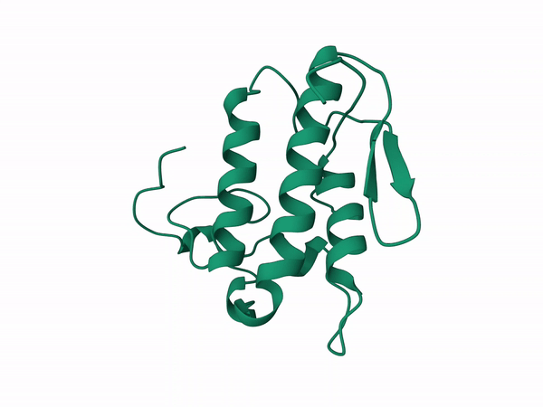

Models were made following modeller basic tutorial using especifications from [Whittington et al. (2018)](https://academic.oup.com/mbe/article/35/4/887/4797214)

# Crotoxin-like Subunit

General pipeline was to print the translated sequence in ali format:

```{bash}
cat CgCrotB/CgCrotB.ali
```

To set the right format you have to substitute the name of you protein and the sequence, but let the other stuff
you have to set a * as stop at the end

The general pipeline is two python scripts taken from the modeller basic tutorial that are present in the bin file

```{bash}
ls bin
```

I used parallel to make several models at once when the chanin of the reference was the same (CgCrotB, CgSCrotA, CgNCrotB). 

the script should be run as follow

- Align2d.py -a < target_sequence.ali > -p < reference.pdf > -c < pdb chain >
- model-sigle.py -a <aligned_target2refence.ali > -k < reference + chain > -s < target name  > model-single


```{bash, eval=FALSE}
parallel -a list -j 2 --verbose " echo {}
mkdir {}_1
cd {}_1
cp ../{}/{}.ali .
cp ../Crotoxin/3r0l.pdb .
python ../bin/align2d.py -a {}.ali -p 3r0l.pdb -c D
python ../bin/model-single.py -a {}-3r0lD.ali -k 3r0lD -s {} > model-single.log
rm 3r0l.pdb"
```

## Crotoxin-like Basic Subunit

### CgCrotB

Beta subunit modeled with D chain of the crotoxin pdb corresponding to the B subunit.

## Crotoxin-like Acidic Subunit

#### CgSCrotA 



Alfa subunit from the south population without cleavage modeled with D chain of the crotoxin pdb corresponding to the B subunit. The results from this run were used as input for [GetArea](https://curie.utmb.edu/getarea.html) server to calculate the Solvent Accesible Surface Area (SASA). The file used was CgSCrotA.B99990004.pdb, as it has the lowest DOPE-HR score, following [Whittington et al. (2018)](https://academic.oup.com/mbe/article/35/4/887/4797214)

```{bash}
tail -n 13 CgSCrotA/model-single.log
```

#### CgSCrotA1

Alfa subunit from the South population with cleavage on sites 1,4,5 modeled with D chain of the crotoxin pdb corresponding to the B subunit.

#### CgSCrotA2

Alfa subunit from the South population with cleavage on sites 1,4,5 and 2,3 modeled with A,B,D chains of the crotoxin pdb corresponding to the A subunit.

## gA1 PLA2 similar to the Acidic Subunit


#### CgNCrotA

Alfa subunit from the North population without cleavage modeled with D chain of the crotoxin pdb corresponding to the B subunit.

#### CgNCrotA1

Alfa subunit from the North population with cleavage on sites 1,4,5 modeled with D chain of the crotoxin pdb corresponding to the B subunit.

#### CgNCrotA2

Alfa subunit from the South population with cleavage on sites 1,4,5, and 2,3 modeled with A,B,D chains of the crotoxin pdb corresponding to the A subunit.

